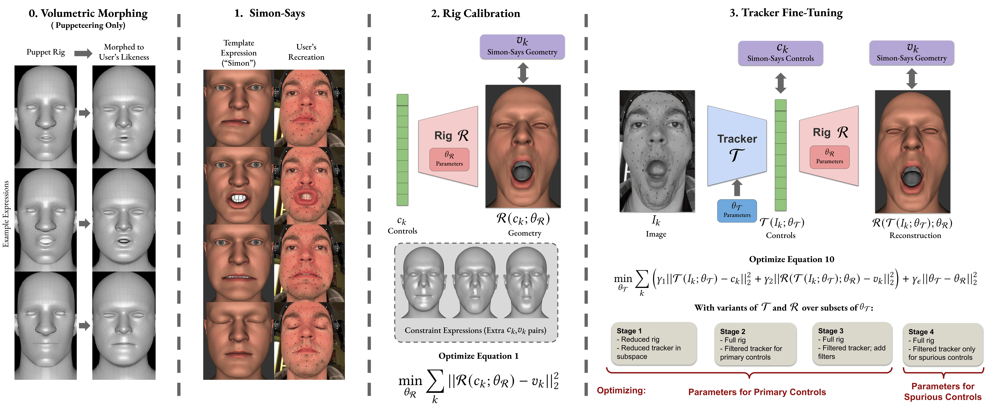

# face-calibration


**Improving Facial Rig Semantics for Tracking and Retargeting**

D. Omens, A. Thurman, J. Yu, R. Fedkiw — Stanford University / Epic Games

[\[Paper (TBR)\]](https://face-calibration.github.io) [\[Project Page\]](https://face-calibration.github.io)

---

## Overview

This package provides tools for **calibrating facial animation rigs** so that automated trackers produce semantically meaningful animation controls suitable for retargeting.

The core ideas: Accurate rig calibration requires a multi-stage pipeline. Firstly, Simon-Says data must be captured and rig calibration must be carefully applied to respect control combinations. Secondly, a tracker that inverts a rig to find controls from geometry is typically not differentiable. We use **implicit differentiation** to compute gradients through the tracker anyway, enabling gradient-based fine-tuning of the rig's internal parameters.

Given a rig `R(c; θ)` and a tracker `T(I; θ)`, we compute `dT/dθ` by solving

```
dR/dc · dT/dθ = −dR/dθ
```

efficiently while accounting for tracker errors. This is packaged as PyTorch autograd Functions, so you can use it in any standard optimization loop.

**This package works with any animation rig implemented as a differentiable Pytorch function.** We include an augmented version of the [FLAME](https://flame.is.tue.mpg.de) parametric head model with semantically meaningful input animation controls as a working example.



## Installation

```bash
git clone https://github.com/YOUR_ORG/face-calibration.git
cd face-calibration
pip install -e .
```

Optional (for interactive 3D viewer):
```bash
pip install -e ".[viewer]"
```

### FLAME Model Setup

1. Download the FLAME model from [https://flame.is.tue.mpg.de](https://flame.is.tue.mpg.de)
2. Place `generic_model.pkl` in `data/FLAME2020/`
3. If available, place `FLAME_texture.npz` in the same directory

## Quickstart

### 1. Run the linear example (no FLAME needed)

```bash
python examples/linear_example.py
```

This demonstrates implicit differentiation on a simple 3x3 linear rig — a minimal proof of the core method.

### 2. Simon-Says calibration (FLAME)

```bash
python examples/flame_calibrate.py --config examples/configs/example_flame.yaml
```

Calibrates the FLAME rig's expression basis using Simon-Says expression targets, corresponding to Equation 1 and Section 5 of the paper.

### 3. Multi-stage tracker fine-tuning (FLAME)

```bash
python examples/flame_finetune.py --config examples/configs/example_flame.yaml
```

Runs the 4-stage optimization pipeline (Section 6 of the paper) to fine-tune the tracker's internal rig parameters via implicit differentiation.

### 4. Track a performance

```bash
python examples/flame_track.py --config examples/configs/example_flame.yaml --targets your_targets.npy
```

## Using with Your Own Rig

The core package is **rig-agnostic**. To use it with your own rig:

### 1. Implement the rig interface

Your rig must be a `torch.nn.Module` with:

```python
class MyRig(torch.nn.Module):
    num_controls: int  # number of animation controls

    def forward(self, controls, rig_parameters=None):
        """
        Args:
            controls: (B, num_controls) animation controls.
            rig_parameters: optional flat tensor of internal parameters.
                When provided, use these instead of the rig's stored params.

        Returns:
            Geometry tensor (B, V, 3) or dict {'face': (B, V, 3), ...}
        """
        ...
```

The `rig_parameters` argument is critical here, and they should be whichever internal parameters affect the mapping of input animation controls to output vertices. It allows out implicit differentiation to compute Jacobians with respect to these internal parameters.

### 2. Use the implicit differentiation

```python
from face_calibration import TrackerFunctionSeparate

# Your rig and tracked controls
rig = MyRig(...)
theta = rig.rig_parameters.clone().requires_grad_(True)

# Pre-compute controls by running your tracker
with torch.no_grad():
    tracked_controls = your_tracker(theta)

# Wrap with implicit differentiation
controls_with_grad = TrackerFunctionSeparate.apply(
    theta, tracked_controls, rig, None
)

# Now you can compute losses and backpropagate through theta
loss = (controls_with_grad - target_controls).square().mean()
loss.backward()  # gradients flow to theta via implicit diff
```

### 3. Use the calibration solver

```python
from face_calibration import RigCalibrationSolver

solver = RigCalibrationSolver(
    rig,
    get_params=lambda r: r.my_params,
    set_params=lambda r, p: setattr(r, 'my_params', p),
)
result = solver.calibrate(targets, controls, iterations=100)
```

### 4. Use the multi-stage fine-tuner

```python
from face_calibration import RigFineTuner

finetuner = RigFineTuner(rig, targets, true_controls)
optimized_params = finetuner.run_all()
```

## Package Structure

```
face_calibration/
├── implicit_diff.py    # Core: TrackerFunction, TrackerFunctionSeparate
├── tracker.py          # L-BFGS trackers with implicit diff backward
├── solver.py           # Simon-Says rig calibration (Eq. 1)
├── finetune.py         # Multi-stage tracker fine-tuning (Section 6)
├── expressions.py      # Simon-Says expression definitions
├── utils.py            # Rotation, mesh I/O, path utilities
└── flame/              # FLAME model integration (example rig)
    ├── flame_model.py  # FLAMERig (MPG licensed)
    ├── lbs.py          # Linear blend skinning
    └── rig.py          # FlameRigPytorch, SemanticFlameRigPytorch
```

## Tested Configurations

| GPU | CUDA | PyTorch | Python |
|-----|------|---------|--------|
| NVIDIA A10G | 11.7 | 2.0+ | 3.10+ |
| NVIDIA RTX 2070 | 11.7 | 2.0+ | 3.10+ |
| CPU only | — | 2.0+ | 3.9+ |

## Citation

```bibtex
@article{omens2026improving,
    title={Improving Facial Rig Semantics for Tracking and Retargeting},
    author={Omens, D. and Thurman, A. and Yu, J. and Fedkiw, R.},
    journal={Computer Graphics Forum},
    year={2026},
    publisher={Wiley}
}
```

## License

This project is released under the MIT License. The FLAME model files (`face_calibration/flame/flame_model.py`, `face_calibration/flame/lbs.py`) are adapted from code copyrighted by the Max Planck Society — see the file headers for their license terms. The FLAME model data must be downloaded separately from [flame.is.tue.mpg.de](https://flame.is.tue.mpg.de) under their license.

